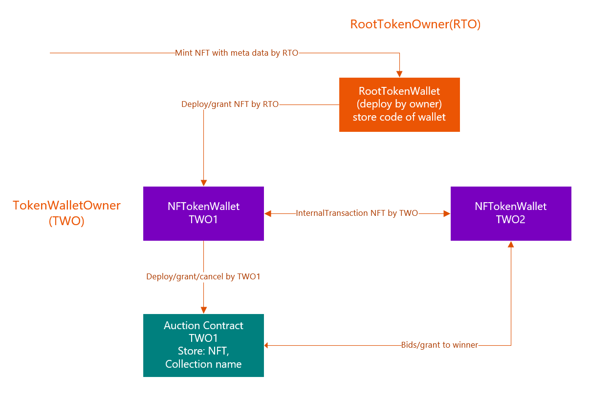

# NTF Marketplace 

## Last update:

[https://github.com/urands/nft_market](https://github.com/urands/nft_market)

## Description
This repository is an attempt to create a MVP for working with NFT in freeton network with tokens of the TIP-3 standard. Initially, the tokens were taken from the official repository ["tonlabs/ton-labs-contracts"](https://github.com/tonlabs/ton-labs-contracts/tree/master/cpp/tokens-nonfungible).
Contracts deployed on test network: [net.ton.dev](net.ton.dev)

RootTokenWallet (RTW) : [0:d9940684ab66b34e50f0e1062165ebd691c966430927fcafab519e3e11cf8942](https://net.ton.live/accounts/accountDetails?id=0%3Ad9940684ab66b34e50f0e1062165ebd691c966430927fcafab519e3e11cf8942)

A token was deployed for account pubkey: 0x65eb078be1ae9186c4ff96e13e0cfe7f67e5cb388da72189260142cd49e4e069

NFTokenWallet (NFT): [0:fdd64bbb036d3f737779eef2ef8441abf4fa906bb282a1e89a6355c39d045bfc](https://net.ton.live/accounts/accountDetails?id=0%3Afdd64bbb036d3f737779eef2ef8441abf4fa906bb282a1e89a6355c39d045bfc)

These are test tokens and they do not have fields for storing meta information. Therefore, it was decided to expand their functionality. Also needed contract   to buy/sell transactions of tokens.
### Implementation


The RTW is deployed by a token owner. The RTW stores NFT wallet contract code for deploy and verification. NFT wallet can sell NFTs by Auction Contract (AC). Auction Contract (AC) deploy by NFT wallet and take NFTs for trade. 

Auction contract contains map of items by tokenId:

+ startingPrice; // Price at beginning of auction
+ endingPrice; // Price at end of auction
+ duration; // Duration (in seconds) of auction
+ startedAt; // Time when auction started

also for implement searching NFT which are available for sale :
+ RTW
+ NFT wallet
+ tag (collection name)

For each collection TWO can deploy own AC.

Functions:
+ function getAuction(uint256 tokenId)
+ function getCurrentPrice(uint256 tokenId)
+ function cancelAuction(uint256 _tokenId)
+ function bid(uint256 tokenId) // incremental bid

Event:
+ event AuctionCreated(uint256 tokenId, uint256 startingPrice, uint256 endingPrice, uint256 duration);
+ event AuctionSuccessful(uint256 tokenId, uint256 totalPrice, address winner);
+ event AuctionCancelled(uint256 tokenId);

tokenId lock in NTF Wallet if granted to AC. AC can call internalTransaction on some events and return bids.
        

## Requirements

- Install [Docker](https://www.docker.com/products/docker-desktop)
- `git clone https://github.com/urands/nft_market.git`

## Instalation/run

```bash
docker-compose build
docker-compose up -d
```
